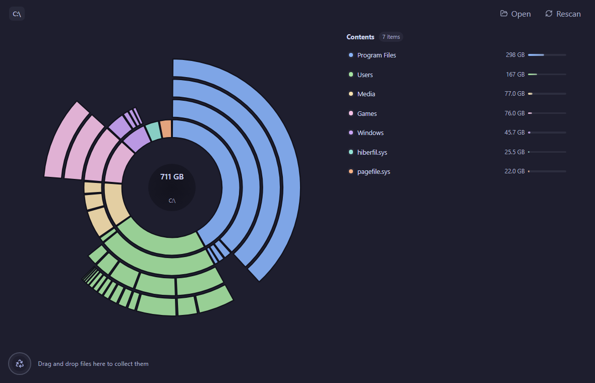
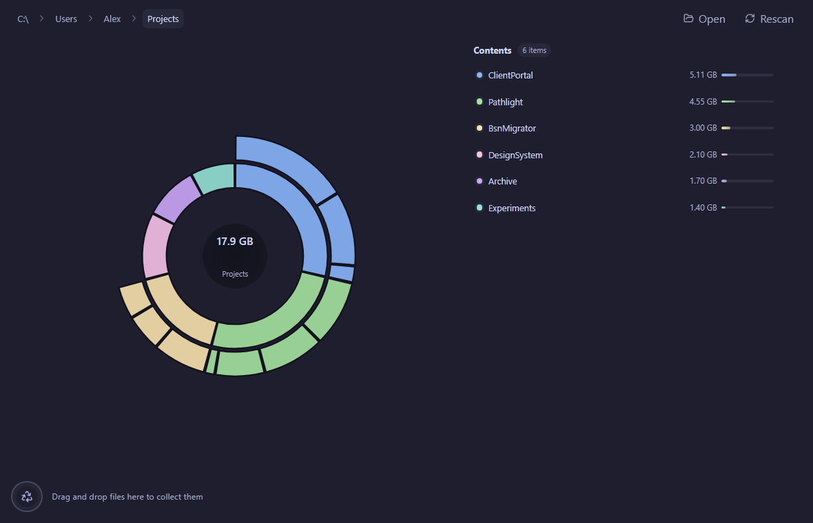

# Pathlight

Fast, minimal disk usage explorer for Windows.

Pathlight scans a disk or folder, shows the largest space consumers in a radial map, and lets you drag items into a cleanup collector before moving them to the Recycle Bin.



## Preview



## Download

The latest preview build is available from [GitHub Releases](https://github.com/johncotdev/pathlight/releases).

Recommended for most users:

- `Pathlight_<version>_x64-setup.exe` - standard Windows installer.

Also available:

- `Pathlight_<version>_x64-portable.zip` - no-install portable build.
- `Pathlight_<version>_x64_en-US.msi` - managed or corporate deployment.

Pathlight is not code-signed yet, so Windows SmartScreen may warn on first launch.

## Development

```powershell
pnpm install
pnpm tauri dev
```

Build a release locally:

```powershell
pnpm build
```

Generate screenshot fixtures from the browser demo mode:

```powershell
pnpm dev:web
# open http://127.0.0.1:1420/?demo=drive
# open http://127.0.0.1:1420/?demo=projects
```

## Release

Pathlight releases are versioned with Git tags:

```powershell
git tag -a v0.1.1 -m "Pathlight 0.1.1"
git push origin v0.1.1
```

The release workflow builds the Windows installer, MSI, and portable zip, then uploads them to the matching GitHub Release.
